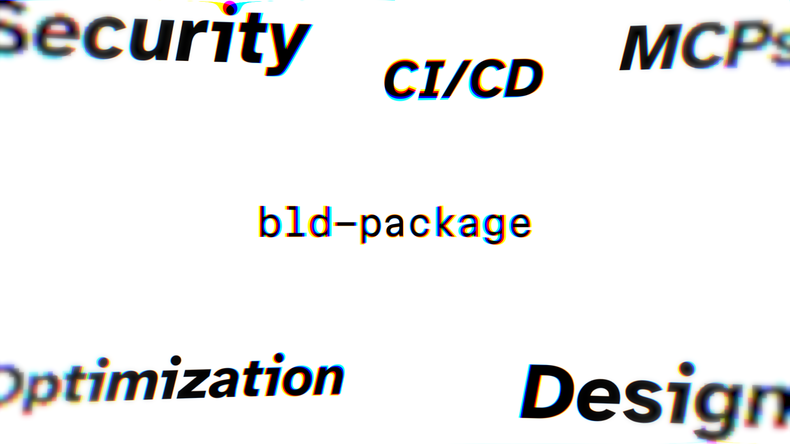

# bld-package

**A lightweight Claude agent skillset, for every step of the ```building``` process.**



# Background
Many skillsets nowadays ship with excessive amounts of skills, subagents, etc. Some clogging up to ***80% of your context*** every session, for skills you'll probably never use.

***BLD is the simplest skillset you'll ever need***. Providing 24 skills for every part of the ```web-development``` process. 

From planning to deployment, it has it all. Including many utility commands ***saving up to 75% of your tokens***. 

&nbsp;


## Contents 📋

- [Install](#install)
- [Installing on macOS or Linux](#installing-on-macos-or-linux)
- [How commands are named](#how-commands-are-named)
- [What BLD will not do](#what-bld-will-not-do)
- [Commands List](#the-commands)
  - [sprint](#sprint) · [optimize](#optimize) · [find](#find) · [runtime](#runtime)
  - [orchestrator](#orchestrator) · [util](#util) · [settings](#settings) · [special](#special)
- [Typing shortcuts](#typing-shortcuts)
- [Repo layout](#repo-layout)
- [License](#license)
- [Credits](#credits)

&nbsp;

## Installation ⬇️

Assuming you already have [Claude Code](https://claude.com/claude-code), plus `npm`
and `git`:

**1. Clone it.**

```bash
git clone https://github.com/mnguyenht/bld-package.git
```

**2. Open Claude in that folder,** or open it in the native Claude app.

```bash
cd bld-package
claude
```

**3. Ask it to set BLD up.**

```
> read skills/bld-setup/SKILL.md and set BLD up
```

Claude should now execute `/bld-setup`, which it'll install all the dependencies and
underlying tools. 

### *Be sure to keep an eye on the installation, read over what you want to install or not, and apply any fixes during the way.*
(Once finished, if you'd like to install any tools / skills in the future, simply re-run /bld-setup.)


&nbsp;


## Installing on macOS or Linux

Same install, same end state. Two things are worth knowing before you start.

**`/bld-setup` has been executed and verified on Windows and on Linux, but never
on macOS.** The commands are written to be cross-platform and preflight checks for
the usual differences, so it should work. Nobody has proven it.

**[MANUAL-INSTALL.md](MANUAL-INSTALL.md) is the same install written out
linearly**, with `python3` and `brew` spellings and no interactive picker. Use it
if you would rather read a list than answer questions, or if you would rather not
be the first to run the guided flow on a Mac.

It also carries the two things the Linux runs measured that catch people out: the
`npm` prefix remedy that Debian and Ubuntu silently ignore, and the check that
your `bun` is the Linux one rather than a Windows shim inherited through WSL.

&nbsp;


## How Commands Are Named ✒️

Every command reads **`bld` · type · skill**. 

```
/bld-sprint-init
 │    │      └──> what it does
 │    └─────────> which kind of skill it is
 └──────────────> the prefix
```

Once you know the set, use `/bld-settings-professional on` to move the type to the end, requiring less typing to reach what you want.

Any commands with 2 parts are special commands, and won't be affected.

&nbsp;


## What bld will NOT do ❌

From a development and UI/UX standpoint, these are the universal guardrails bld follows:

- **It will not push your code without confirmation.**
- **It will not fix what you did not mention.** 
- **It will not invent a number.** *(prices, testimonials, or proof. Everything stays as placeholders.)*
- **Nothing runs in the background.** *(MCP servers are only utilized when called, then immediately killed. No third parties behind every query.)*

&nbsp;

## The Commands 📃

### -sprint

*Main commands to initiate coding sprints.*

| Command | What it does |
|---|---|
| `/bld-sprint-planning` | Helps you sketch out the architecture and everything Claude needs to know before building your project.|
| `/bld-sprint-init` | An initial sprint to build the scaffolds of your app, such as landing pages, routing, and protoyping. |
| `/bld-sprint-refine` | Refining your initial build into something pleasing to use, consolidating the design style further, and improves overall UI/UX. |

### -optimize

*App optimization commands using different tools.*

| Command | What it does |
|---|---|
| `/bld-optimize-app` | Lighthouse against the shipped app, three runs and a median, because one run is a sample and not a measurement. |
| `/bld-optimize-react` | Static scan of your source with react-doctor and your own eslint. Findings are hypotheses, so it triages before it fixes. |
| `/bld-optimize-security` | A static security pass, 13 layers deep. Free, local, and it reports rather than auto-fixing. |
| `/bld-optimize-seo-indexing` | Gets an app found on Google. Audits the live site with curl instead of trusting the source. |

### -find

*Searches for fitting, pre-made professional assets instead of needing Claude to build it.*

| Command | What it does |
|---|---|
| `/bld-find-21st` | Browses [21st.dev](https://21st.dev) for different UI components. From backgrounds to shader effects.|
| `/bld-find-spline` | Find 3D interactive assets from [Spline](https://spline.design) to make your website come to life. |

### -runtime

*Runtime optimization and token management.*

| Command | What it does |
|---|---|
| `/bld-runtime-agents` | Boss mode over an external coding agent. Claude specs and reviews, the agent writes. Needs a Codex or Gemini account. |
| `/bld-runtime-tokens` | How much of your Claude window is left, and what to do about it. |
| `/bld-runtime-activate-mcps` | Spawns a code-search server, fires one batch of queries, kills it. |

### -orchestrator

*Claude orchestrates other agents instead of writing code.*

| Command | What it does |
|---|---|
| `/bld-orchestrator-fable` | Plan, execute in parallel, judge each report as a skeptic, re-spec until it passes. |
| `/bld-orchestrator-opus` | The same loop with Opus in the boss seat. |

### -util

*Handy general functions for every part of the .*

| Command | What it does |
|---|---|
| `/bld-util-deploy` | Automatically pushes to your GitHub repos and integrates with Vercel. After the first run, shipping is simply a commit and a push. |
| `/bld-util-handoff` | Snapshots the session so you can pick up in fresh context before it rots. |
| `/bld-util-documentation` | Writes a `/docs` page for your app, in Simplified Technical English. Half-built features go under Known limits. |
| `/bld-util-customize-component` | Builds a customization menu in the browser, to help fine-tune a real component. Then simply let Claude know what you chose. |
| `/bld-util-copywriting` | Humanizes and makes sure any writing drives the value of your app. Eliminating litotes, irony, or any phrasing that sounds machine-written. |

### -settings

*Customize bld to your liking.*

| Command | What it does |
|---|---|
| `/bld-settings-mcp` | Switches BLD's MCP policies between ```on-demand``` and ```always-on```. |
| `/bld-settings-professional` | Switches the naming scheme between the two conventions. |
| `/bld-settings-block-image-generation` | ```Enable``` or ```Disable``` image-generation blocking, Enabled by default. |

### -special

*Acts on BLD itself.*

| Command | What it does |
|---|---|
| `/bld-setup` | Sets BLD up, or adds more of it later. Remembers where it got to. |
| `/bld-quiz` | A learning checkpoint after a sprint, at matching depth. Small changes get a walkthrough instead. |

&nbsp;


## Typing Shortcuts ⌨️

The slash menu is not always reachable. So every command's description now
**starts with a two-character shortcut and a colon**, and typing one as the
first thing in a message runs that command:

```
si: a habit tracker for students
```

does the same as `/bld-sprint-init a habit tracker for students`. It only
counts at the very start of a message, so a shortcut in the middle of a
sentence stays ordinary text. Shortcuts do not move in pro mode. Only the
command name reorders.

| Type | Shortcuts |
|---|---|
| **sprint** | `sp:` planning · `si:` init · `sr:` refine |
| **optimize** | `oa:` app · `or:` react · `os:` security · `oi:` seo-indexing |
| **find** | `f2:` 21st · `fs:` spline |
| **runtime** | `rm:` activate-mcps · `ra:` agents · `rt:` tokens |
| **orchestrator** | `of:` fable · `oo:` opus |
| **util** | `uc:` copywriting · `us:` customize-component · `ud:` deploy · `um:` documentation · `uh:` handoff |
| **settings** | `gi:` block-image-generation · `gm:` mcp · `gp:` professional |
| **special** | `bs:` setup · `qz:` quiz |

This is a convention the model follows, not a parser. It is a little less
certain than picking the command out of the slash menu, so if a shortcut ever
lands on the wrong command, use the full name for that one.

&nbsp;


## Repo layout

```
bld-package/
├── README.md
├── MANUAL-INSTALL.md               the install written out by hand
├── skills/                         24 commands, one folder each
│   ├── bld-setup/
│   │   ├── SKILL.md
│   │   ├── references/manifest.md  every tool, with source links
│   │   ├── references/skills.md    every command, and what each one needs
│   │   ├── scripts/preflight.py    what is installed, what is missing
│   │   └── scripts/scenarios.py    regression tests for preflight
│   ├── bld-sprint-*/               planning · init · refine
│   ├── bld-optimize-*/             app · react · security · seo-indexing
│   ├── bld-find-*/                 21st · spline
│   ├── bld-runtime-*/              agents · tokens · activate-mcps
│   ├── bld-orchestrator-*/         fable · opus
│   ├── bld-util-*/                 deploy · handoff · documentation · customize-component · copywriting
│   ├── bld-quiz/
│   ├── bld-settings-professional/
│   │   └── scripts/switch-mode.py  renames every command between modes
│   └── bld-settings-block-image-generation/
│       └── scripts/block-image-generation.py   the image-generation hook
├── agents/
│   └── bld-executor.md             the worker the orchestrators fan out to
└── templates/
    ├── CLAUDE.global.md            machine-wide rules
    └── CLAUDE.workspace.md         workspace rules
```


## License

MIT.

The security checklists in `skills/bld-optimize-security/references/ecc/` are
vendored from [affaan-m/ECC](https://github.com/affaan-m/ECC) and stay under
ECC's own MIT license, included in full beside them.


## Credits

BLD is mostly glue. The people below wrote the parts that do the hard work, and
every one is worth a look on its own terms. (This table is shown during `/bld-setup`)

### -Claude Code plugins

| Tool | What it does | Source |
|---|---|---|
| ponytail | Anti-over-engineering mode. Forces the laziest solution that works. | [DietrichGebert/ponytail](https://github.com/DietrichGebert/ponytail) |
| ui-ux-pro-max | The design engine behind `/bld-sprint-init`. Styles, palettes, font pairings, UX rules. | [nextlevelbuilder/ui-ux-pro-max-skill](https://github.com/nextlevelbuilder/ui-ux-pro-max-skill) |
| claude-code-setup | Anthropic's official setup advisor. | [anthropics/claude-plugins-official](https://github.com/anthropics/claude-plugins-official) |

### -Skills

| Tool | What it does | Source |
|---|---|---|
| emil-design-eng | Emil Kowalski on UI polish, component feel, animation. | [emilkowalski/skills](https://github.com/emilkowalski/skills) |
| animation-vocabulary | Names a motion effect so you can ask for it by its real term. | [emilkowalski/skills](https://github.com/emilkowalski/skills) |
| review-animations | Strict animation craft gate. | [emilkowalski/skills](https://github.com/emilkowalski/skills) |
| impeccable | Design craft and audit, 23 sub-commands. | [pbakaus/impeccable](https://github.com/pbakaus/impeccable) |
| gstack | Garry Tan's engineering framework. BLD turns on 5 of its 54 skills and skips its installer. | [garrytan/gstack](https://github.com/garrytan/gstack) |
| karpathy-guidelines | Anti-slop rules: ask before coding, surgical changes. | [multica-ai/andrej-karpathy-skills](https://github.com/multica-ai/andrej-karpathy-skills) |
| find-skills | Discovers skills on skills.sh. | [vercel-labs/skills](https://github.com/vercel-labs/skills) |
| copywriting | Headlines, CTAs, value props, landing page copy. | [coreyhaines31/marketingskills](https://github.com/coreyhaines31/marketingskills) |
| a11y-audit | WCAG 2.2 A and AA scan, fix, verify. | [alirezarezvani/claude-skills](https://github.com/alirezarezvani/claude-skills) |
| framer-motion | Disney's 12 animation principles in Framer Motion. | [dylantarre/animation-principles](https://github.com/dylantarre/animation-principles) |
| webapp-testing | Drives a local app with Playwright. | [anthropics/skills](https://github.com/anthropics/skills) |
| terms-of-service | Drafts and reviews SaaS terms. | [shawnpang/startup-founder-skills](https://github.com/shawnpang/startup-founder-skills) |
| privacy-policy | Drafts and reviews privacy policies. | [shawnpang/startup-founder-skills](https://github.com/shawnpang/startup-founder-skills) |
| ECC checklists | Parts of the security checklists behind `/bld-optimize-security`. Vendored into the skill rather than installed separately, under MIT, with the source commit pinned in `references/ecc/SOURCES.md`. | [affaan-m/ECC](https://github.com/affaan-m/ECC) |
| agent-skills | The practices behind the "Test-first" rules in `templates/CLAUDE.global.md` and the docs-first section of `/bld-sprint-init`. Adapted into those files, not installed. | [addyosmani/agent-skills](https://github.com/addyosmani/agent-skills) |

### -CLI tools

| Tool | What it does | Source |
|---|---|---|
| lighthouse | Google's page auditor. The engine behind `/bld-optimize-app`. | [GoogleChrome/lighthouse](https://github.com/GoogleChrome/lighthouse) |
| react-doctor | Static React scanner. The engine behind `/bld-optimize-react`. | [millionco/react-doctor](https://github.com/millionco/react-doctor) |
| react-scan | Runtime re-render overlay. | [aidenybai/react-scan](https://github.com/aidenybai/react-scan) |
| claude-monitor | Local Claude Code usage monitor. Powers `/bld-runtime-tokens`. | [Maciek-roboblog/Claude-Code-Usage-Monitor](https://github.com/Maciek-roboblog/Claude-Code-Usage-Monitor) |
| vercel | Deploy target. | [vercel/vercel](https://github.com/vercel/vercel) |
| gh | GitHub CLI. Creates the private repo in `/bld-util-deploy`. | [cli/cli](https://github.com/cli/cli) |

### -MCP servers

| Server | What it does | Source |
|---|---|---|
| jcodemunch | Token-cheap code search. Read-only. | [jgravelle/jcodemunch-mcp](https://github.com/jgravelle/jcodemunch-mcp) |
| context-mode | Heavier code context. Its `ctx_execute` runs real shell commands, so BLD treats it as the highest-trust item it offers. | [mksglu/context-mode](https://github.com/mksglu/context-mode) |
| shadcn | Real registry data so components are not guessed. | [shadcn-ui/ui](https://github.com/shadcn-ui/ui) |

### -Optional tools for `/bld-runtime-agents`

| Tool | Why it is separate | Source |
|---|---|---|
| codex | Delegation executor. Needs a paid ChatGPT plan. | [openai/codex](https://github.com/openai/codex) |
| gemini-cli | Delegation fallback. Has a free tier. | [google-gemini/gemini-cli](https://github.com/google-gemini/gemini-cli) |
